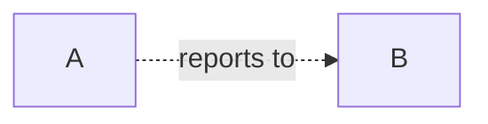
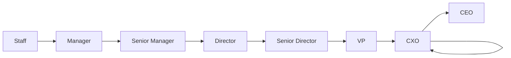
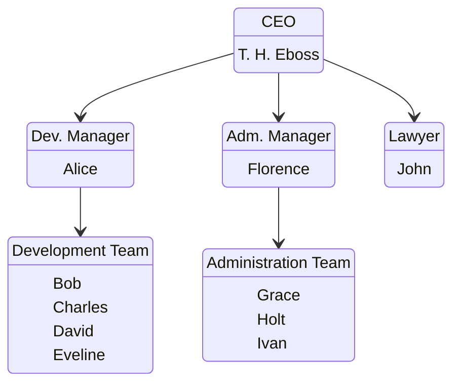

Test Mermaid in Github

```mermaid
graph TD;
    A-->B;
    A-->C;
    B-->D;
    C-->D;
```

```mermaid
flowchart LR
   A -. reports to .-> B
```

```mermaid
graph LR;
    Staff --> Manager --> SM[Senior Manager] --> Director --> SD[Senior Director] --> VP --> CXO --> CXO --> CEO;
```

```mermaid
stateDiagram-v2
    state "CEO" as ceo
    state "T. H. Eboss" as ceo
    ceo --> devmngr
    ceo --> admmngr
    ceo --> law

    state "Dev. Manager" as devmngr
    state "Alice" as devmngr
    devmngr --> dev

    state "Development Team" as dev
    state "Bob" as dev
    state "Charles" as dev
    state "David" as dev
    state "Eveline" as dev

    state "Adm. Manager" as admmngr
    state "Florence" as admmngr
    admmngr --> adm

    state "Administration Team" as adm
    state "Grace" as adm
    state "Holt" as adm
    state "Ivan" as adm

    state "Lawyer" as law
    state "John" as law
```
