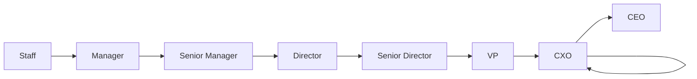
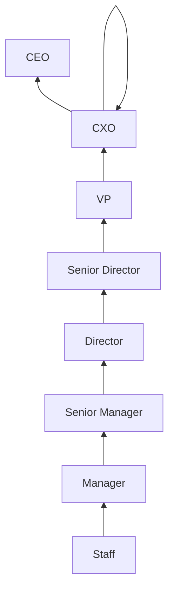
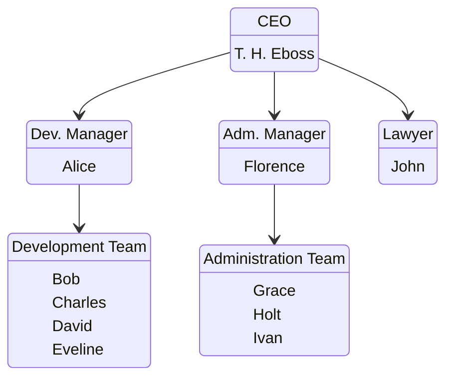

Test Mermaid in Github

https://mermaid.js.org/syntax/flowchart.html


Company Reporting Line:






```mermaid
graph LR

STAFF1 [Staff 1: first s1 last s1] --> M1 [Manager 1: first m1, last m1]
STAFF2 [Staff 2: first s2 last s2] --> M1
M1 --> SM1 [Senior Manager: first sm1, last sm1)
SM1 --> SVP1 [ SVP 1: first_svp1, last_svp2]
SVP1 --> SVP2 [SVP 2: first_svp2, last_Svp2]
SVP2 --> CEO
```
 



